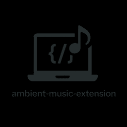

# 🧠 VS Code Extensions by Tajul Islam

> Developer-first tools to make coding focused, elegant, and efficient.

---

## 🎵 Ambient Music AutoPlayer
> Play ambient/lofi YouTube music automatically while coding in VS Code.

- 🔗 [Marketplace Link](https://marketplace.visualstudio.com/items?itemName=taj154dev.ambient-music-autoplayer)

---

## 🧠 More Coming Soon...

 
---

## 🔗 Connect With Me

- [GitHub](https://github.com/taj54)
- [Portfolio](https://taj54.github.io)
- [LinkedIn](https://linkedin.com/in/tajul-islam-j)

